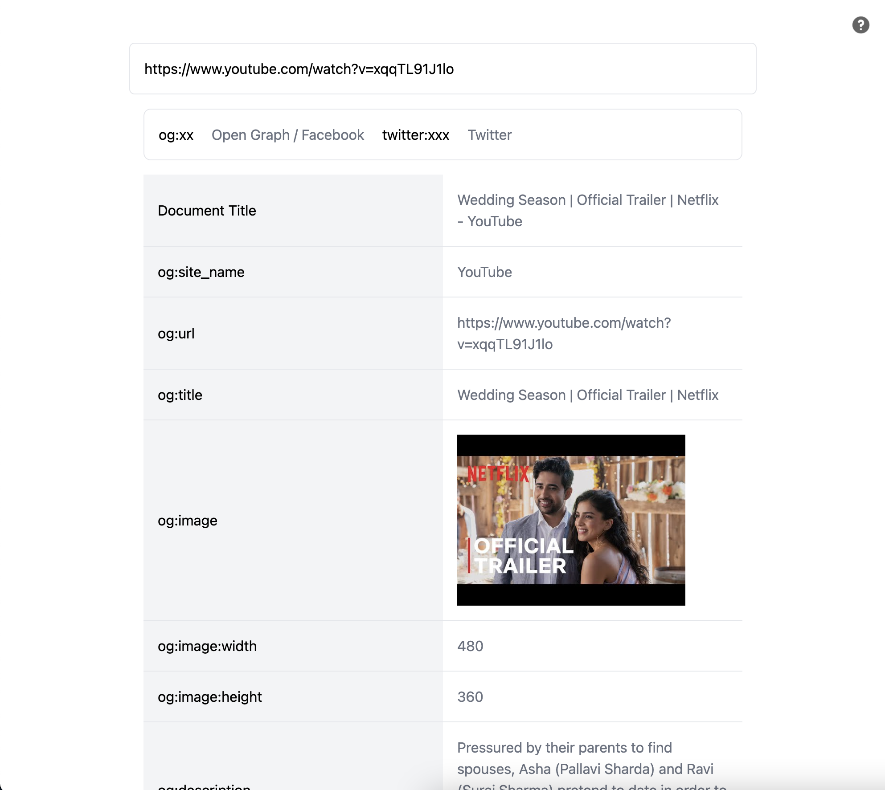

# Link preview

Get meata related to link that can be used to show preview when you share.

### Usage (local)

Start the project:

```
deno task start
```

This will watch the project directory and restart as necessary.

## Ouput


